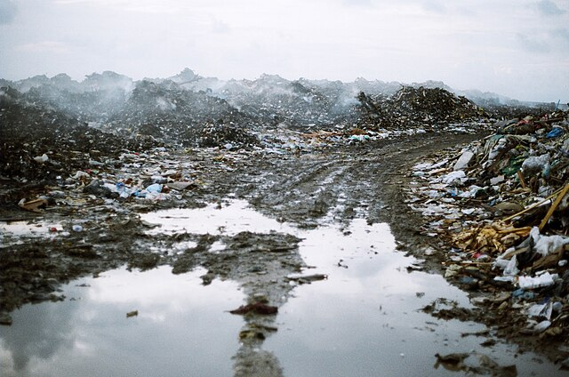

# Red de territorios de sacrificio: gestión y problemáticas en torno a los residuos sólidos en Costa Rica, en un contexto de cambio climático.

 { width="400" height="300" style="display: block; margin: 0 auto" }

(Fuente de la imagen: <A HREF="https://upload.wikimedia.org/wikipedia/commons/thumb/d/d6/Piles_of_waste_in_Thilafushi%2C_2012_%281%29.jpg/640px-Piles_of_waste_in_Thilafushi%2C_2012_%281%29.jpg">Wikimedia Commons</A>)

## Descripción del proyecto:
El manejo de los residuos sólidos es uno de los ejes centrales de los Objetivos de Desarrollo Sostenible con los que el país se encuentra comprometido (Secretaría Técnica ODS, 2016). Su tratamiento adecuado es fundamental en un contexto de cambio climático, ya que debido a la quema y al proceso de descomposición, estos residuos generan la emisión de gases de efecto invernadero. De la misma manera, su manejo apropiado permite reducir la producción de *lixiviados*, líquidos que surgen de la descomposición y mezcla de los residuos y que se convierten en foco de contaminación de suelos y fuentes de agua (de Miguel, et al., 2021; Global Alliance for Incinerator Alternatives (GAIA), 2022; International Solid Waste Association, 2009; Rakes et al., 2023; Vicari, 2015).

Si bien a nivel global paulatinamente se ha instalado una narrativa oficial que invita a dejar de llamarle “basura” a los “residuos valorizables” (Global Alliance for Incinerator Alternatives (GAIA), 2022), la experiencia latinoamericana muestra que la disposición de estos residuos se realiza mediante la quema o el depósito en botaderos a cielo abierto y en rellenos sanitarios. Mientras que en los botaderos los residuos se depositan sin ningún tipo de tratamiento, en los rellenos se siguen técnicas controladas, sanitarias y seguras, lo que impide la contaminación de suelos, fuentes de agua y malos olores. Por lo general, los rellenos se encuentran operados por empresas de carácter transnacional (Chidi Nzeadibe, 2012; Weber, 2012). Tanto las estrategias de quema como el entierro de los residuos (sea en botaderos o en rellenos sanitarios) imposibilitan que estos se valoricen, lo que desencadena una serie de problemáticas ambientales y sociales.

A pesar de que Costa Rica ha avanzado en el marco legal para el manejo de los residuos sólidos, con la aprobación de una serie de instrumentos que regulan el tratamiento de los residuos ordinarios, electrónicos, sanitarios y peligrosos (Asamblea Legislativa, 2010; Gobierno de la República de Costa Rica, 2016; Ministerio de Salud, 2016), las problemáticas vinculadas a su manejo se mantienen vigentes. De acuerdo con la OCDE, Costa Rica deposita un 80% de los residuos municipales en vertederos y solo un 7% se recupera (Organización para la Cooperación y Desarrollo Económico (OCDE), 2023).

Según la Encuesta Nacional de Hogares (ENAHO) del 2022, 91,54% de las viviendas (1 576 856 viviendas) dispone sus residuos en camiones recolectores, 6,33% quema sus residuos (109 009 viviendas), 1,89% los entierra (32 553 viviendas), 0,10% los deposita en lotes baldíos (1 651 viviendas) y 0,3% (582 viviendas) los bota en ríos, quebradas y mares (Instituto Nacional de Estadística y Censos (INEC), 2022). Tanto los datos de la OCDE como los del INEC muestran los grandes desafíos que el país enfrenta en el tema.

Más allá del estudio de casos específicos, este proyecto tiene como objetivo general analizar el proceso de constitución de la *red de territorios de sacrificio* por la gestión y las problemáticas relacionadas con los residuos sólidos en el país. El concepto *red de territorios de sacrificio* hace referencia a las conexiones existentes entre los distintos territorios trazados por dinámicas o problemáticas que no son exclusivas de un territorio específico y que constituyen territorios y poblaciones sacrificables, en este caso, en torno a los residuos sólidos (Mora, 2023). En la investigación se utilizará un *método de análisis documental mixto* (Pole, 2009), con el que se reconstruirá el proceso de gestión y las problemáticas surgidas del manejo de los residuos, mediante registros administrativos y fuentes secundarias, además se generarán análisis espaciales a partir de los datos georreferenciados relacionados al tema.

## Descripción de los datos y sus principales variables:

 { width="400" height="300" style="display: block; margin: 0 auto" }

(Fuente de la imagen: elaboración propia)

1. **Registros administrativos y fuentes secundarias.**
    - **Descripción:** Datos georreferenciados según las unidades político-administrativas (siempre y cuando las fuentes lo permitan, se utilizará el nivel de desagregación cantonal de los datos).
    - **Variables:** Id, localización cantonal e información cuantitativa y cualitativa asociada (pendientes de definir).
1. **Sitios de disposición de los residuos.**
    - **Descripción:** Capa de puntos de la localización de los rellenos sanitarios y botaderos.
    - **Variables:** Id, localización cantonal y provincial, tipo, nombre y coordenadas X y Y.
2. **División administrativa (distrital, cantonal y provincial)**
    - **Descripción:** Capa de polígonos de la división político administrativa de Costa Rica.
    - **Variables:** Código de catálogo y dta, provincia, cantón, distrito, código de cantón, código de provincia, área y región.
3. **Comunidades cercanas a los territorios de sacrificio.**
    - **Descripción:** Capa de puntos de las comunidades situadas en zonas de sacrificio.
    - **Variables:** Id, nombre y localización cantonal y provincial.
4. **Hidrografía.**
    - **Descripción:** Capa de líneas de los ríos, quebradas y quebradas intermitentes de Costa Rica.
    - **Variables:** Tipo, nombre, longitud, código.
5. **Carreteas**
    - **Descripción:** Capa de líneas de carreteras de Costa Rica.
    - **Variables:** Código, nombre, jerarquía, longitud y número de ruta.

## Problema o pregunta que se espera resolver
**¿Cómo se ha constituido la red de territorios de sacrificio en Costa Rica?**
Se busca entender los procesos históricos, políticos, sociales, económicos y geográficos que han llevado a la configuración de ciertos territorios como "sacrificables" en términos de gestión de residuos sólidos y analizar cómo se espacializan y conectan entre sí.

## Bibliografía
Asamblea Legislativa. (2010). Ley para la Gestión Integral de Residuos. Asamblea Legislativa de la República de Costa Rica.

Chidi Nzeadibe, T. (2012). Open Dump. En C. Zimring & W. Rathje (Eds.), Encyclopedia of Consumption and Waste. The Social Science of Garbage (pp. 631-633). Sage Publications. 

de Miguel, C., Martínez, K., Pereira, M., &Kohout. (2021). Emisiones de gases de efecto invernadero y mitigación en el sector residuos: La economía del cambio climático en la Argentina. Comisión Económica para América Latina y el Caribe. [https://www.cepal.org/es/publicaciones/39360-emisiones-gases-efecto-invernadero-mitigacion-sector-residuos-la-economia-cambio](https://www.cepal.org/es/publicaciones/39360-emisiones-gases-efecto-invernadero-mitigacion-sector-residuos-la-economia-cambio)

Global Alliance for Incinerator Alternatives (GAIA). (2022). De basura cero a cero emisiones. Por qué reducir los residuos es clave para combatir el cambio climático. University Avenue, Berkeley.

Gobierno de la República de Costa Rica. (2016). Plan Nacional para la Gestión Integral de Residuos 2016-2021. Ministerio de Salud. 

Instituto Nacional de Estadística y Censos (INEC). (2022). Encuesta Nacional de Hogares (ENAHO). Instituto Nacional de Estadística y Censos (INEC).

International Solid Waste Association. (2009). Residuos y cambio climático. International Solid Waste Association.

Ministerio de Salud. (2016). Estrategia Nacional de Separación, Recuperación y Valorización de Residuos (ENSRVR). Ministerio de Salud.

Mora, S. (2023). Red de zonas de sacrificio: Los vínculos entre depósitos de basura en Costa Rica. Artículo en proceso de publicación. 

Organización para la Cooperación y Desarrollo Económico (OCDE). (2023). OCDE. Evaluaciones del desempeño ambiental. Costa Rica. 2023. OCDE.

Pole, K. (2009). Diseño de metodologías mixtas. Una revisión de las estrategias para combinar metodologías cuantitativas y cualitativas. Renglones. Revista arbitrada en ciencias sociales y humanidades, 60, 37-42. 

Rakes, K., Urriola-Cuevas, C., Pica-Téllez, A., Gonzales, L., Pérez, G., Sime, M., Pérez, S. B., Figueroa, V., Harris, J., Talbot-Wright, H., & Vogt-Schilb, A. (2023). Guía para la acción climática en municipios y gobiernos regionales: Hacia territorios carbono-neutrales y resilientes ante el cambio climático. Banco Interamericano de Desarrollo (BID). [https://publications.iadb.org/es/guia-para-la-accion-climatica-en-municipios-y-gobiernos-regionales-hacia-territorios-carbono](https://publications.iadb.org/es/guia-para-la-accion-climatica-en-municipios-y-gobiernos-regionales-hacia-territorios-carbono)

Secretaría Técnica ODS. (2016). Inventario de Políticas Públicas según los Objetivos de Desarrollo Sostenible (ODS). Secretaría Técnica ODS-MIDEPLAN.

Vicari, R. (2015). Emisiones de gases de efecto invernadero y mitigación en el sector residuos La economía del cambio climático en la Argentina. Comisión Económica para América Latina y el Caribe (CEPAL).
